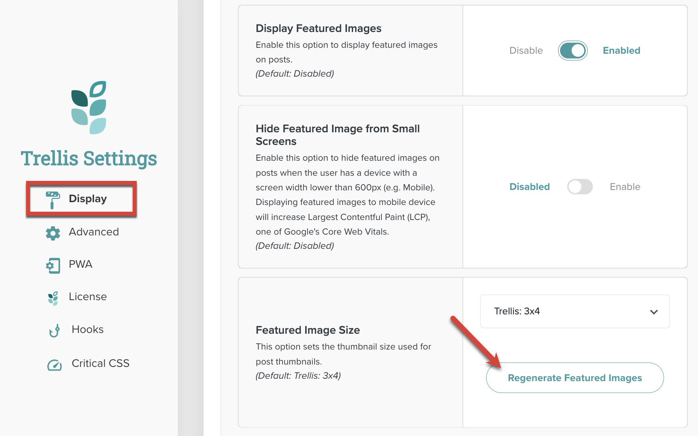
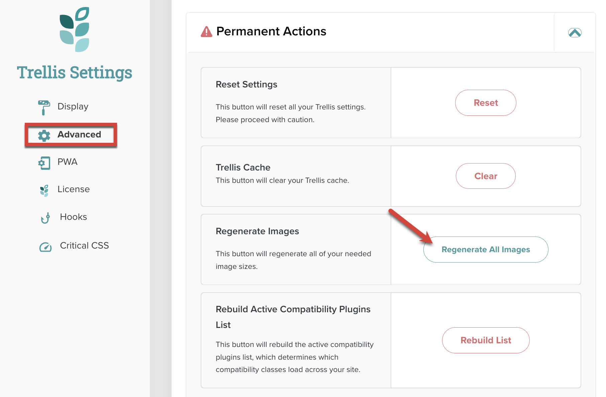

When using Trellis, several image-specific features are available to make your pages load faster and improve your site’s Google Core Web Vitals score. These include:

- **Image delivery enhancements.** For the first image in the content (or the featured image), Trellis checks if it is eager loaded (via a specified class or attribute). If not, it will add code. It also initally renders the first image as a gray SVG image, swapping it out for the actual image when it comes into view. For all other images, Trellis makes sure that a `loading="lazy"` attribute exists to take advantage of modern web browsers' support for lazy loading. Developers can alter eager and lazy loading behavior per image or across the entire site (see more below).
- **Image thumbnail size optimizations.** Trellis instructs WordPress to create additional image sizes for uploaded images based on the Featured Image size setting. Existing images can be retroactively processed via a Regenerate Featured Images button or Regenerate All Images button in Trellis Settings.
- **(Optional) Image formatting optimizations.** If the optional Trellis Images plugin is installed, Trellis will generate WebP versions of legacy image formats when visitors go to a page and then swap them for the WebP version.

## Eager Loading and First Image Delivery

Trellis checks for an `eager-load` class or a `loading="eager"` attribute on the first image in content (or the featured image). If it doesn't find either, it will automatically add the `loading="eager"` attribute.

Additionally, Trellis increases LCP scores by initially rendering the first image as a gray SVG with the same dimensions. When the page finishes loading, Trellis uses JavaScript to replace the SVG with the correct image just before it comes into view.

### Disabling First Image Eager Loading Across the Site

(As of 0.18.0) If you want to disable Trellis' automatic eager loading functions, you can add the following filter to your child theme’s functions.php file:

```php
/**
  * Disable Trellis eager loading
*/
add_filter( 'mv_trellis_disable_eagerload_first_image', '__return_true' );
```

### Disabling First Image Eager Loading Per Image

(As of 0.15.3) If you want to prevent Trellis from adding a `loading="eager"` attribute to specific images, you can add a class to the `` tag.

| Class      | Description                                                  |
| ---------- | ------------------------------------------------------------ |
| eager-load | This class stops Trellis from adding the `loading="eager"` attribute. |

### Disabling First Image SVG Replacement

(As of 0.18.0) If you want to disable Trellis' SVG replacement feature, you can add the following filter to your child theme’s functions.php file:

```php
/**
  * Disable Trellis first image SVG replacement
*/
add_filter( 'mv_trellis_disable_svg_preload_first_image', '__return_true' );
```

## Lazy Loading Delivery

Lazy loading is the practice of delaying the load or initialization of objects until they’re needed by the browser. For all images other than the first image (or featured image), Trellis ensures that a `loading="lazy"` attribute is present for images and iframes. This allows modern browsers to use their native lazy loading features.

{}
Lazy loading is also automatically applied to iframe content. The instructions for disabling lazy loading per image also applies to iframes.
{}

### Disabling Lazy Loading Across the Site

If you plan on using a different lazy loading solution (or just want to disable Trellis’ lazy loading functionality site-wide), you can add the following filter to your child theme’s functions.php file:

```php
/**
  * Disable Trellis lazy loading
*/
add_filter( 'mv_trellis_enable_lazy_load', '__return_false' );
```

### Disabling Lazy Loading Per Element

If you want to disable Trellis' lazy loading features on a specific element, you can apply a class to an `` or `<iframe>` tag or block.

| Class       | Description                                                  |
| ----------- | ------------------------------------------------------------ |
| no-lazyload | This class stops Trellis from checking for the `loading="lazy"` attribute. The content will be served as-is. |

## Image Size Optimization

WordPress has a predefined set of image sizes it creates when a new image is uploaded. When active, Trellis modifies this set to add more sizes that are frequently used in publisher sites. This helps prevent the [“Properly Size Images" Warning in Google Pagespeed Insights](https://web.dev/uses-responsive-images/).

Publishers can choose a desired featured image thumbnail size and ratio in the **Display** tab of Trellis Settings. Depending on the size selected, additional sizes (as listed in the Image Sizes chart) will be created by WordPress whenever an image is uploaded or on post save when the featured image size is changed.

The **Regenerate Featured Images** button will add all featured images to a queue and have their necessary Trellis sizes created by WordPress. See [Trellis Featured Images](https://product-help.mediavine.com/en/articles/5691530-trellis-featured-images) in the Help Center for more information.



If a publisher wants to regenerate Trellis sizes on all of the images on their site (Featured Images included), they can go to the **Advanced** tab of Trellis Settings and use the **Regenerate All Images** button. Depending on the size selected in the Featured Image Size, additional sizes (as listed in the Image Sizes chart) will be created by WordPress. See [How to Regenerate Your Image Sizes in Trellis](https://product-help.mediavine.com/en/articles/5528297-how-to-regenerate-your-image-sizes-in-trellis) in the Help Center for more information.



## Image Sizes Chart

By default, Trellis will generate all image sizes for the selected Featured Image Size and a high res size for all other sizes not selected. Image sizes are grouped by setting.

{}
Trellis never alters original images. The additional images it creates will, however, be cropped accordingly and take up space in the site’s upload directory.
{}

### Trellis: Square (1x1)

| Image Size Slug                               | Dimensions | Cropping                                         |
| --------------------------------------------- | ---------- | ------------------------------------------------ |
| mv_trellis_1x1 (also mv_trellis_1x1_high_res) | 728x728    | Cropped to fit.                                  |
| mv_trellis_1x1_med_high_res                   | 480x480    | Cropped to fit.                                  |
| mv_trellis_1x1_med_res                        | 320x320    | Cropped to fit.                                  |
| mv_trellis_1x1_low_res                        | 200x200    | Cropped to fit.                                  |
| mv_trellis_3x4                                | 546x728    | Cropped to fit.                                  |
| mv_trellis_4x3                                | 728x546    | Cropped to fit.                                  |
| mv_trellis_16x9                               | 728x410    | Cropped to fit.                                  |
| mv_trellis_srcset_960                         | 960x960    | Proportionally resized to fit inside dimensions. |
| mv_trellis_srcset_1080                        | 1080x1080  | Proportionally resized to fit inside dimensions. |

### Trellis: 3x4

| Image Size Slug                               | Dimensions | Cropping                                         |
| --------------------------------------------- | ---------- | ------------------------------------------------ |
| mv_trellis_3x4 (also mv_trellis_3x4_high_res) | 546x728    | Cropped to fit.                                  |
| mv_trellis_3x4_med_res                        | 360x480    | Cropped to fit.                                  |
| mv_trellis_3x4_low_res                        | 240x320    | Cropped to fit.                                  |
| mv_trellis_1x1                                | 728x728    | Cropped to fit.                                  |
| mv_trellis_4x3                                | 728x546    | Cropped to fit.                                  |
| mv_trellis_16x9                               | 728x410    | Cropped to fit.                                  |
| mv_trellis_srcset_960                         | 960x960    | Proportionally resized to fit inside dimensions. |
| mv_trellis_srcset_1080                        | 1080x1080  | Proportionally resized to fit inside dimensions. |

### Trellis: 4x3 (Trellis Default)

| Image Size Slug                               | Dimensions | Cropping                                         |
| --------------------------------------------- | ---------- | ------------------------------------------------ |
| mv_trellis_4x3 (also mv_trellis_4x3_high_res) | 728x546    | Cropped to fit.                                  |
| mv_trellis_4x3_med_res                        | 480x360    | Cropped to fit.                                  |
| mv_trellis_4x3_low_res                        | 320x240    | Cropped to fit.                                  |
| mv_trellis_1x1                                | 728x728    | Cropped to fit.                                  |
| mv_trellis_3x4                                | 546x728    | Cropped to fit.                                  |
| mv_trellis_16x9                               | 728x410    | Cropped to fit.                                  |
| mv_trellis_srcset_960                         | 960x960    | Proportionally resized to fit inside dimensions. |
| mv_trellis_srcset_1080                        | 1080x1080  | Proportionally resized to fit inside dimensions. |

### Trellis: 16x9

| Image Size Slug                                 | Dimensions | Cropping                                         |
| ----------------------------------------------- | ---------- | ------------------------------------------------ |
| mv_trellis_16x9 (also mv_trellis_16x9_high_res) | 728x410    | Cropped to fit.                                  |
| mv_trellis_16x9_med_res                         | 480x270    | Cropped to fit.                                  |
| mv_trellis_16x9_low_res                         | 320x180    | Cropped to fit.                                  |
| mv_trellis_1x1                                  | 728x728    | Cropped to fit.                                  |
| mv_trellis_3x4                                  | 546x728    | Cropped to fit.                                  |
| mv_trellis_4x3                                  | 728x546    | Cropped to fit.                                  |
| mv_trellis_srcset_960                           | 960x960    | Proportionally resized to fit inside dimensions. |
| mv_trellis_srcset_1080                          | 1080x1080  | Proportionally resized to fit inside dimensions. |

### WP Core Sizes

While most WP Core sizes are unaffected, Trellis does make changes to the 1200 x 1200 and post-thumbnail sizes.

| Image Size Slug | Dimensions | Cropping                                                     | Modifications                                                |
| --------------- | ---------- | ------------------------------------------------------------ | ------------------------------------------------------------ |
| thumbnail       | 150x150    | Cropped to fit                                               | None. This size is provided by WP Core.                      |
| medium          | 300x300    | Proportionally resized to fit inside dimensions              | None. This size is provided by WP Core.                      |
| medium_large    | 768x768    | Proportionally resized to fit inside dimensions              | None. This size is provided by WP Core.                      |
| large           | 1024x1024  | Proportionally resized to fit inside dimensions              | None. This size is provided by WP Core.                      |
| 1200x1200       | 1200x1200  | Proportionally resized to fit inside dimensions              | Trellis replaces the WP Core 1536x1536 size with this one.   |
| 2048x2048       | 2048x2048  | Proportionally resized to fit inside dimensions              | None. This size is provided by WP Core.                      |
| post-thumbnail  | Depends    | Uses the default image size of the selected Trellis Featured Image size. Since it uses Trellis’ size, no additional post-thumbnail file is generated. | Provided by WP Core, but the dimensions are controlled by Trellis. |

## Useful Filters and Functions

The following image filters and functions can be used in Trellis child theme code. For additional filters and functions, see the [Reference]() section.

### Filters

- [mv_trellis_article_nav_image_orientation]()
- [mv_trellis_article_nav_image_res]()
- [mv_trellis_default_featured_image_size]()
- [mv_trellis_disable_convert_image_to_lazyload_when_enabled]()
- [mv_trellis_disable_eagerload_first_image]()
- [mv_trellis_disable_lazy_load_classes]()
- [mv_trellis_disable_process_images]()
- [mv_trellis_disable_set_image_cls_aspect_styles]()
- [mv_trellis_disable_set_image_dimensions]()
- [mv_trellis_disable_svg_preload_first_image]()
- [mv_trellis_enable_lazy_load]()
- [mv_trellis_excerpt_image_res]()
- [mv_trellis_excerpt_image_sizes]()
- [mv_trellis_featured_post_image_res]()
- [mv_trellis_featured_post_image_sizes]()
- [mv_trellis_image_orientation]()
- [mv_trellis_image_sizes]()
- [mv_trellis_image_sizes_attribute]()
- [mv_trellis_match_image_dimensions]()
- [mv_trellis_post_link_featured_image_sizes]()
- [mv_trellis_resolution_sizes]()

### Functions

- [mv_trellis_get_attachment_image_tag]()
- [mv_trellis_the_attachment_image_tag]()
- [mvt_adjust_excerpt_image_orientation_res]()
- [mvt_adjust_featured_post_image_orientation_res]()
- [mvt_adjust_excerpt_image_sizes]()
- [mvt_adjust_featured_post_image_sizes]()
- [mvt_get_image_orientation_res]()
- [mv_trellis_get_featured_image_tag]()