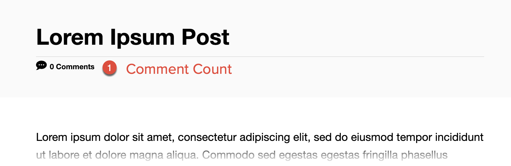
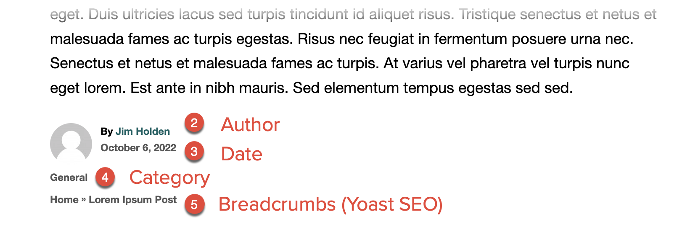
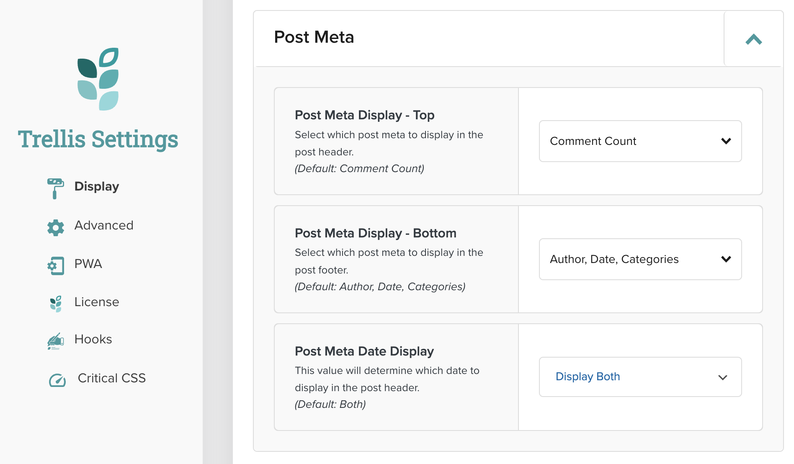

Publishers can control Post Meta settings using the Mediavine Trellis Dashboard, selecting what information appears. Available meta information includes: Author, Breadcrumbs (if the Yoast SEO plugin is active), Categories, Comment Count, and Date (Published, Modified, or both).

{}
Trellis templates provided by Mediavine limit Comment Count to the top of a post. If you’d like to add the Comment Count to the bottom of a post, refer to the code in the Additional Information section.
{}

The image below shows the default Post Meta information as rendered by the Trellis Core theme with Yoast SEO installed.





## Settings

Publishers can control the Post Meta information and where it gets displayed via the Mediavine Trellis Dashboard. These settings store values that can be accessed by various filters and functions. Template parts contain logic to render the information.



| Setting Name | Description | Usage |
| --- | --- | --- |
| Post Meta Display - Top | Select which post meta to display in the post header. Options include: Comment Count, Author, Date, and Categories.<br /><br />If Yoast SEO is installed, you can show Yoast breadcrumbs. | Refer to the article-meta-header template part in Trellis Core to see how this is implemented.<br /><br />Location: mediavine-trellis/template-parts/article/article-meta-header.php |
| Post Meta Display - Bottom | Select which post meta to display in the post footer. Options include: Author, Date, and Categories.<br /><br />If Yoast SEO is installed, you can show Yoast breadcrumbs. | Refer to the article-meta-footer template part in Trellis Core to see how this is implemented.<br /><br />Location: mediavine-trellis/template-parts/article/article-meta-footer.php |
| Post Meta Date Display | Determine the date to display in the post header. Options include: Display Modified, Display Published, or Display Both. | Created by the mv_trellis_entry_date() function. Refer to the article-meta-header or article-meta-footer template parts in Trellis Core for reference. |

## Functions

The selected settings in the Mediavine Trellis Dashboard can be accessed via the `mv_trellis_is_meta_item_enabled()` function. Individual options are queried by their slug to determine if the publisher has them set. Available Post Meta slugs include:

- author
- breadcrumbs (only available if Yoast SEO is installed)
- categories
- comment_count
- date

The function also specifies a location, which can be:

- post_meta_top
- post_meta_bottom

**Example**

In the following example, the `$display_author` variable will be set to `true` or `false` depending on (1) if the post type supports an author, and (2) if the Trellis Post Meta Author setting is enabled and set to the top of the post.

```php
$display_author = ( post_type_supports( get_post_type( $post_id ), 'author' ) && mv_trellis_is_meta_item_enabled( 'author', 'post_meta_top' ) );
```

If a Post Meta item is available, other functions are used to output its value.

- author: `mv_trellis_entry_author()`
- date: `mv_trellis_entry_date()`
- comment_count: Calculated in the article_meta_header template
- categories: `mv_trellis_entry_taxonomies`
- breadcrumbs: Assembled from an internal class and posted to the hook specified by the `mv_trellis_top_breadcrumbs_placement` filter.

**Example**

The following example shows how the post’s Author meta information is output in article-meta-header.php.

```
if ( $display_author ) {
		?>
		<p class="author-meta post-author meta-wrapper">
			<?php
				echo esc_html__( 'By: ', 'mediavine' );
				mv_trellis_entry_author();
			?>
		</p>
		<?php
	}
```

## Useful Filters

One filter is available to adjust breadcrumb placement if Yoast SEO is installed:

- `mv_trellis_top_breadcrumbs_placement`: Specifies the hook where the Post Meta breadcrumbs value is placed. The default is `tha_aside_before_entry_content`, which is output by `mvt_entry_before()` in the Trellis Core templates. See Hooks in the Reference section for a list of all available hooks.

## Additional Information

To best understand how Post Meta information is displayed, refer to the article-meta-header.php and article-meta-footer.php template parts in Trellis Core.

### Moving the Comment Count

If you’d like to display the Comment Count at the bottom of a post, you’ll need to add code to your child theme’s functions.php file as well as modifying the article-meta-footer.php template part.

**Functions.php**

This code will add the Comment Count as an option to the Post Meta setting in the Mediavine Trellis Dashboard:

```php
/**
 * Allows the Comment Count to be used at the bottom of Post Meta.
 */
 
 add_filter( 'mv_trellis_before_update_post_meta_bottom', 'mv_add_comments_option_to_post_meta_bottom' );
 
 function mv_add_comments_option_to_post_meta_bottom( array $setting ) {
     $setting['data']['options']['comment_count'] = 'Comment Count';
 
     return $setting;
 }
```

**Article-meta-footer.php**

You’ll need to add code to three places in the article-meta-footer.php template part. First, you’ll want to check if the Comment Count has been enabled for the footer:

```php
// Check if the Comment Count is set for the bottom of Post Meta
$mv_trellis_display_comment_count = ( ( comments_open( $mv_trellis_post_id ) || get_comments_number() ) && ! post_password_required() && mv_trellis_is_meta_item_enabled( 'comment_count', 'post_meta_bottom' ) );
```

Next, you’ll want to modify the post’s check for meta output to include the Comment Count:

```php
// If we don't have any meta output, get out
if ( ! $mv_trellis_display_author && ! $mv_trellis_display_date && ! $mv_trellis_display_comment_count && ! $mv_trellis_display_categories && ! $mv_trellis_display_breadcrumbs ) {
	return;
}
```

Finally, enter code to render the Comment Count:

```
// Comments.
	if ( $display_comment_count ) {
		?>
		<div id="comment-count" class="meta-element meta-wrapper">
			<div>
				<?php mv_trellis_get_template_part( 'template-parts/svg/comment-bubble' ); ?>
				<?php
				/* translators: %s: number of comments for the post */
				echo esc_html( sprintf( _n( '%s Comment', '%s Comments', get_comments_number(), 'mediavine' ), number_format_i18n( get_comments_number() ) ) );
				?>
			</div>
		</div>
		<?php
	}
```