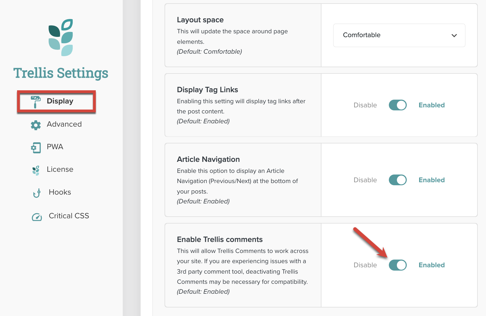

Trellis defers the loading of the remaining comments (which can be a huge part of page markup) until they're actually needed.

## Enabling Trellis Comments

Trellis Comments are enabled by default. Publishers can access the setting that controls them by going to **Appearance >** **Mediavine Trellis** and clicking on **Display**. The toggle is available in the Layout section.

## How Trellis Comments Work

The first five top-level comments on a post are server-rendered via the [WordPress REST API](https://developer.wordpress.org/rest-api/). A [Preact](https://preactjs.com/) app then modifies a `div` constructed by Trellis' class-comments.php file. Trellis then populates these comments with extra data and user interface elements.

{}
The class-comments.php file can be found in mediavine-trellis/inc/classes/class-comments.php. Markup for the comments is found in the mediavine-trellis/comments.php template.
{}

Finally, Trellis fetches all comments for the post that are stored in the component state. When a site visitor requests more comments, no additional REST requests are made.

## Compatibility Issues

When Trellis Comments is enabled, comments are submitted via the [WordPress REST API](https://developer.wordpress.org/rest-api/). This can cause conflicts with third-party plugins that add additional fields (such as ratings) to a post's comments field. Most plugins save data via the form submission, not an API call, which can cause issues.

Trellis attempts to mitigate any problems by saving each field in the comment form as a piece of comment metadata. However, when a comment plugin uses a different `name` for the form field than it does the meta key, there will be a problem.

If you plan on using additional comment plugins with your Trellis child theme, be sure to test them. If there are conflicts, you may need to disable Trellis Comments entirely. See [Trellis Themes: Conflicts and Compatibilities](https://intercom.help/mediavine-products/en/articles/5046317-trellis-themes-conflicts-and-compatibilities) in the Help Center for information on known plugins that don’t work well with Trellis.

## Useful Filters

The following filters can be used in Trellis child theme code for comments. For additional filters and functions, see the [Reference]() section.

- [mvt_requires_default_wp_fields]()
- [mv_trellis_comments_template]()