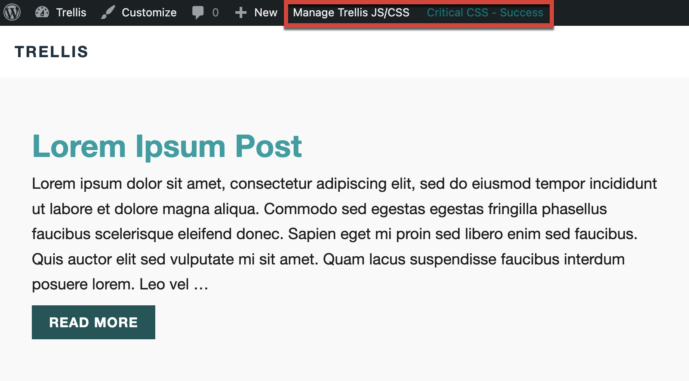
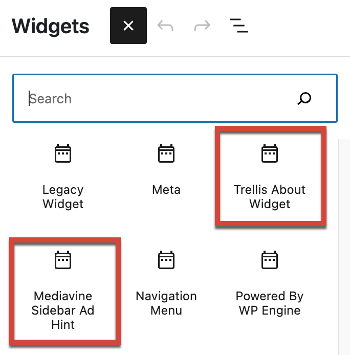
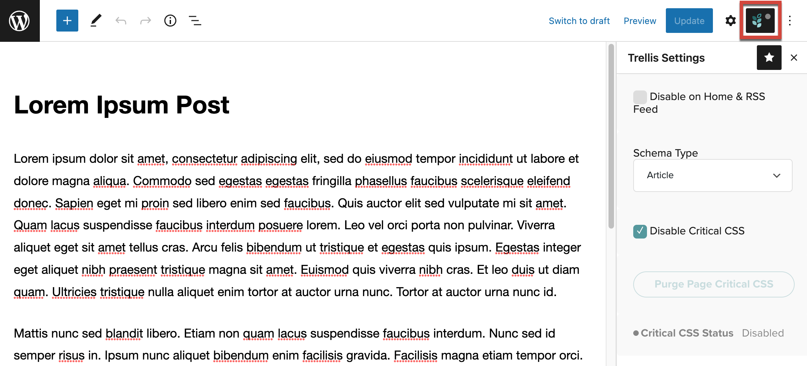
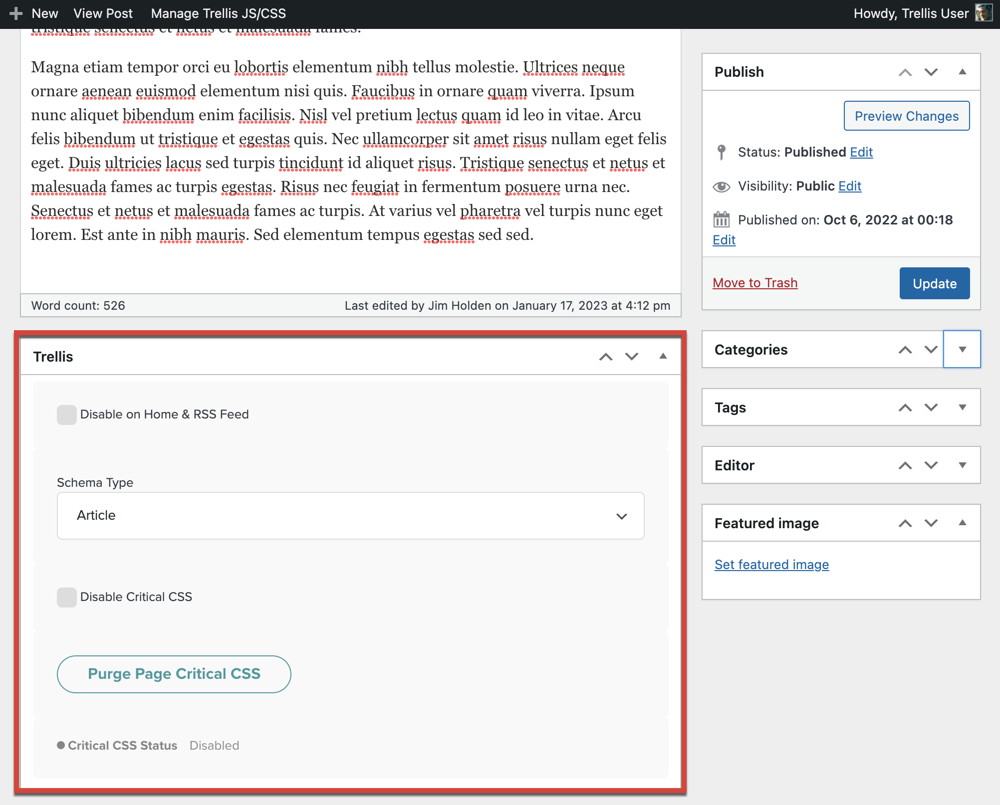
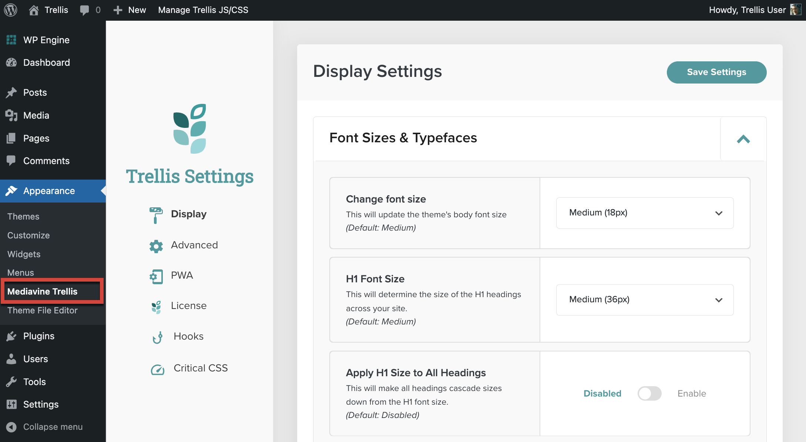

These controls let the publisher purge Critical CSS and JavaScript files, add Trellis-specific widgets to areas in the child theme, define the schema for posts, and adjust theme-specific styling, as well as other Trellis settings.

## Additions to the WordPress Admin Bar

When logged in, the WordPress Admin Bar will contain a menu for controlling Trellis’ JavaScript and Critical CSS features. It also shows the status of Critical CSS file generation.

### Manage Trellis JS/CSS Menu

This menu provides options for rebuilding the Trellis minified Javascript file and for purging Critical CSS files (for the entire site or for the displayed page). The specific commands are explained in the table below.

{}
The Manage Trellis JS/CSS menu will show different commands depending on if you are viewing a page or are in an admin dashboard (refer to the table below). The Critical CSS Status will only appear if you are viewing a page or post on your site.
{}

| Command | Description |
| --- | --- |
| Rebuild Minified JS | Rebuilds the minified JavaScript files for the entire site.  |
| Purge All Critical CSS | Rebuilds the optimized CSS files for the entire site and removes existing optimized CSS files. No optimized CSS will be served until replacement CSS files have been rebuilt.   This option is useful for troubleshooting if you have a display issue appearing on your site, as removing the optimized CSS will use the site’s original CSS files for rendering.  |
| Purge Page CSS | Same as Purge All Critical CSS but only for the current page. |

For a more detailed explanation of the menu options, see [Critical CSS in the Admin Bar](https://product-help.mediavine.com/en/articles/4964387-critical-css-in-the-admin-bar) in the Trellis Help Center.

### Critical CSS Status

When viewing pages on your site, a Critical CSS Status bar shows where Trellis is in the Critical CSS file generation process. One of the statuses in the table below will be displayed.

| Status | Description |
| --- | --- |
| Critical CSS - License Required | The site is missing an active Trellis license. Go to **Trellis Settings** and click **License** to purchase or add a Trellis license. |
| Disabled | Critical CSS generation has been disabled for the post or page. It will also be displayed if Critical CSS is disabled in Trellis Settings. |
| Error | The page encountered an error while generating the Critical CSS files. See [Troubleshooting]() for some steps you can take to determine the problem. |
| None | The page has not attempted to generate Critical CSS yet. As of Trellis 0.16.0, a page in the Pending or Processing status will switch to None if it doesn’t receive a response from the Trellis Services API after two hours. |
| Pending | (Deprecated in 0.17.0.) The page has been queued for regeneration of Critical CSS. |
| Processing | The page is currently in the process of generating Critical CSS files. A request has been sent to the Trellis Services API, but the files haven’t been saved to the site yet. |
| Success | The page successfully generated Critical CSS files. |

## Trellis Widgets

Trellis adds two new widgets to WordPress: a Mediavine Sidebar Ad Hint widget and a Trellis About Widget.

| Widget | Description |
| --- | --- |
| Trellis About Widget | A [WordPress legacy widget](https://developer.wordpress.org/block-editor/how-to-guides/widgets/legacy-widget-block/) that displays general information about the site. Publishers can add a Title, Description, Image, and whether to display it on mobile devices. |
| Mediavine Sidebar Ad Hint | Used for sites that display Mediavine ads. The widget controls the placement of Mediavine top sidebar ads and whether they are shown on mobile devices. For more information, see [How to Move Your First Sidebar Ad](https://product-help.mediavine.com/en/articles/5146388-how-to-move-your-first-sidebar-ad) in the Trellis Help Center. |

## Trellis Settings in the WordPress Editor

When editing posts or pages, publishers can configure specific Trellis features (see the table below). In the Block editor, a new menu is added to the top toolbar. In the Classic editor, a block is shown below the content.  Different options are available depending on whether the content is a post or a page.

*Block Editor (Post Settings)*

*Classic Editor (Post Settings)*

### Available Settings for Posts

| Setting | Description |
| --- | --- |
| Disable on Home/RSS Feed | Hides the post from the Home page and RSS feed. |
| Schema Type | Defines the schema type of the post for SEO purposes. Only visible when **Trellis Settings > Advanced > Trellis SEO Output** is enabled. Options include [Article](https://schema.org/Article), [NewsArticle](https://schema.org/NewsArticle), and [BlogPosting](https://schema.org/BlogPosting). |
| Disable Critical CSS | Disables Critical CSS generation for the post. Useful if the publisher is seeing conflicts or display issues with Critical CSS on an individual post. |
| Purge Page Critical CSS | Deletes the Critical CSS files for the current post only. (As of 0.18.0) Only visible if the post's Critical CSS files have been successfully generated. |
| Critical CSS Status | Shows the Critical CSS status for the current post. Options include the entries listed in the Critical CSS Status section above. |

### Available Settings for Pages

| Setting | Description |
| --- | --- |
| Disable Critical CSS | Disables Critical CSS generation for the page. Useful if the publisher is seeing conflicts or display issues with Critical CSS on an individual page. |
| Purge Page Critical CSS | Deletes the Critical CSS files for the current page. (As of 0.18.0) Only visible if the page's Critical CSS files have been successfully generated. |
| Critical CSS Status | Shows the Critical CSS status for the current page. Options include the entries listed in the Critical CSS Status section above. |
| Hide Page Title | Suppresses the page's title when rendered. |

## Trellis Settings

Trellis adds a Mediavine Trellis submenu to the WordPress Appearance menu. This brings up Trellis Settings, where publishers and developers can set theme options, add a license, and control overall Trellis behavior.

More information is available on the [Trellis Settings]() page, which discusses each setting and how to integrate it into Trellis child themes. 

## What’s Next?

- Get to know the available options in [Trellis Settings]()
- Get started [creating a Trellis child theme]()