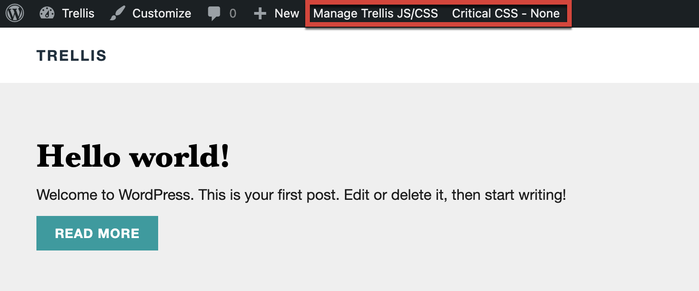
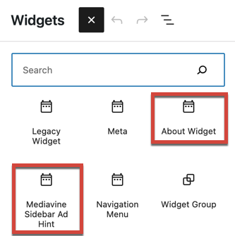
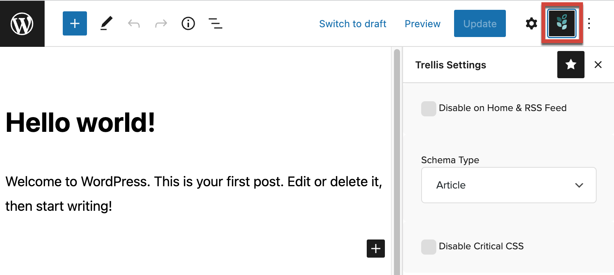
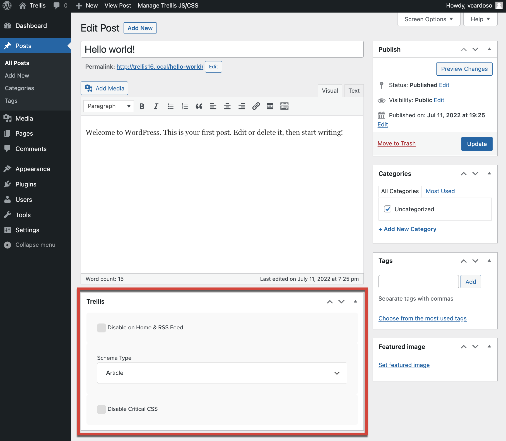
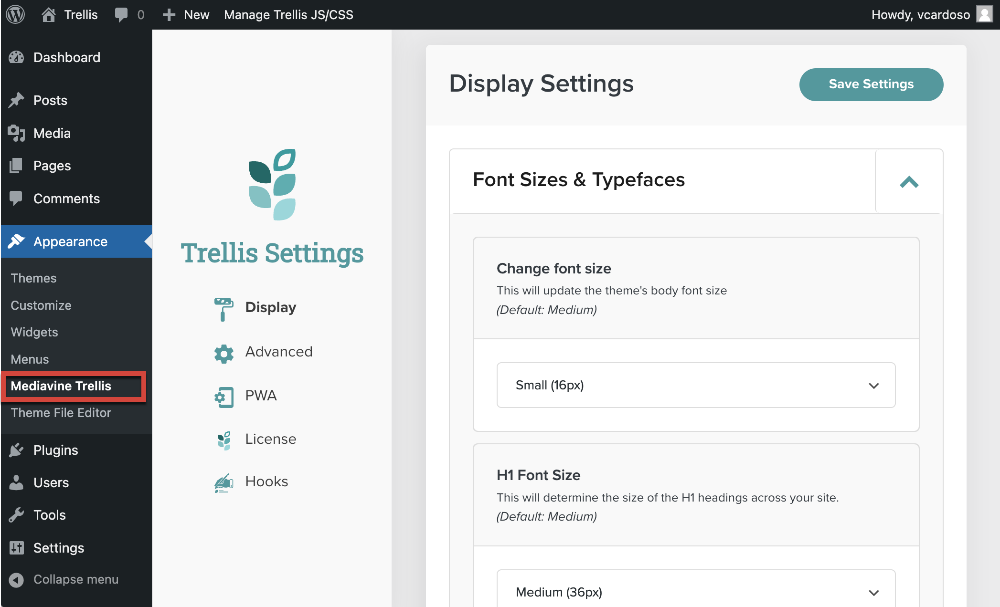

These controls let the publisher purge Critical CSS and JavaScript files, add Trellis-specific widgets to areas in the child theme, define the schema for posts, and adjust theme-specific styling, as well as other Trellis settings.

## Additions to the WordPress Admin Bar

When logged in, the WordPress Admin bar will contain a menu for controlling Trellis’ JavaScript and Critical CSS features and for showing the status of Critical CSS file generation.

### Manage Trellis JS/CSS Menu

This menu provides options for rebuilding, resetting, and purging Critical CSS files (for the entire site or for the displayed page) and for regenerating the Trellis minified Javascript file. The specific commands are explained in the table below.

{}
The Manage Trellis JS/CSS menu will show different commands depending on if you are viewing a page or are in an admin dashboard (refer to the table below). The Critical CSS Status will only appear if you are viewing a page or post on your site.
{}

| Command | Description |
| --- | --- |
| Purge All Critical CSS | Sends a request to the Trellis Services API to rebuild the optimized CSS files for the entire site, but removes existing optimized CSS files. No optimized CSS will be served until replacement CSS files have been rebuilt.   This option is useful for troubleshooting if you have a display issue appearing on your site, as removing the optimized CSS will use the site’s original CSS files for display.   This command is always available. |
| Purge Page CSS | Same as Purge All Critical CSS but for the current page. This command is only available when viewing a page on your site. |
| Rebuild Minified JS | Sends a request to the Trellis Services API to rebuild the minified JavaScript files for the entire site.  This command is always available. |

For a more detailed explanation of the menu options, see [Critical CSS in the Admin bar](https://product-help.mediavine.com/en/articles/4964387-critical-css-in-the-admin-bar) in the Trellis Help Center.

### Critical CSS Status

When viewing pages on your site, a Critical CSS Status bar shows where Trellis is in the Critical CSS file generation process. One of the statuses in the table below will be displayed.

| Status | Description |
| --- | --- |
| Disabled | Critical CSS generation has been disabled for the post or page. |
| Error | The page encountered an error while generating the Critical CSS files. Email trellis@mediavine.com for help resolving the issue. |
| None | The page has not attempted to generate Critical CSS yet. As of Trellis 0.16.0, a page in the Pending or Processing status will switch to None if it doesn’t receive a response from the Trellis API after two hours. |
| Pending | The page has been queued for regeneration of Critical CSS. |
| Processing | The page is currently in the process of generating Critical CSS files. A request has been sent to the Trellis API, but the files haven’t been saved to the site yet. |
| Success | The page successfully generated Critical CSS files. |

## Trellis Widgets

Trellis adds two new widgets to WordPress: a Mediavine Sidebar Ad Hint widget and an About Widget.

| Widget | Description |
| --- | --- |
| About Widget | A [WordPress legacy widget](https://developer.wordpress.org/block-editor/how-to-guides/widgets/legacy-widget-block/) that displays general information about the site. Publishers can add a Title, Description, and Image. |
| Mediavine Sidebar Ad Hint | Used for sites that display Mediavine ads. The widget controls the placement of Mediavine top sidebar ads and whether they are shown on mobile devices. For more information, see [How to Move Your First Sidebar Ad](https://product-help.mediavine.com/en/articles/5146388-how-to-move-your-first-sidebar-ad) in the Trellis Help Center. |

## Trellis Settings on the Posts/Pages Editing Screen

When editing posts or pages, Trellis Settings let publishers configure individual features. In the Gutenberg editor, a new menu is added to the top toolbar. In the Classic editor, a block is shown below the content.  Different options are available depending on whether the content is a post or a page.

*Gutenberg Editor (Post Settings)*

*Classic Editor (Post Settings)*

### Available Settings for Posts

| Setting | Description |
| --- | --- |
| Disable on Home/RSS Feed | Hides the post from the Home page and RSS feed. |
| Schema Type | Defines the schema type of the post for SEO purposes. Options include [Article](https://schema.org/Article), [NewsArticle](https://schema.org/NewsArticle), and [BlogPosting](https://schema.org/BlogPosting). |
| Disable Critical CSS | Disables the Critical CSS feature for the post. Useful if the publisher is seeing conflicts or display issues with Critical CSS on an individual post. |

### Available Settings for Pages

| Setting | Description |
| --- | --- |
| Disable Critical CSS | Disables the Critical CSS feature for the page. Useful if the publisher is seeing conflicts or display issues with Critical CSS on an individual page. |
| Hide the Home Page Title | Hides the page title when set as a static home page for the site. |

## Mediavine Trellis Dashboard

Trellis adds a Mediavine Trellis submenu to the WordPress Appearance menu. This dashboard  lets publishers and developers set theme options, add a license, and control overall Trellis behavior.

More information is available on the Trellis Settings page, which discusses each setting and how to integrate it into Trellis child themes. 

## What’s Next?

- Get to know the available options in [Trellis Settings]()
- Get started [creating a Trellis child theme]()