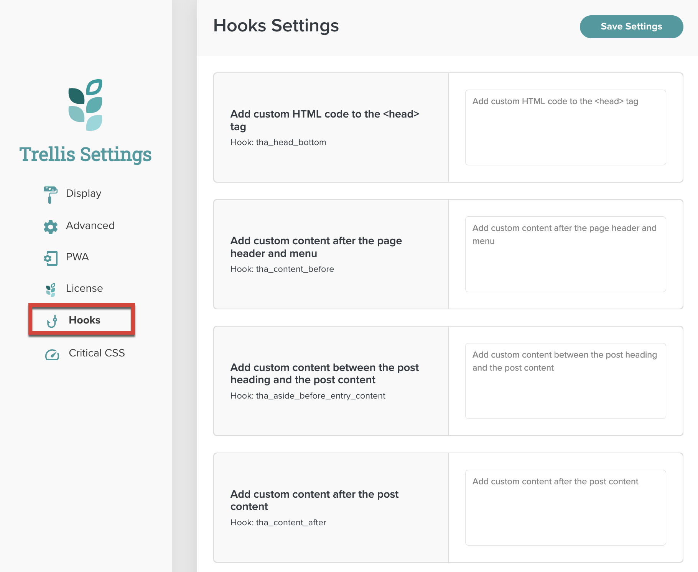

Trellis includes the [Theme Hook Alliance (THA)](https://github.com/zamoose/themehookalliance) standards, offering a consistent set of entry points for easy customization and altering of functionality. However, instead of firing THA hooks directly within templates, Trellis Core and Bamboo, Birch, and Wisteria templates use custom Trellis functions. These functions fire the THA hooks and, in some cases, perform additional tasks.

For example, in the content-article.php template part, instead of the traditional method of calling a THA hook:

```php
do_action('tha_aside_before_entry_content');
```

Trellis uses the following custom function:

```php
mvt_aside_before_entry_content();
```

This accomplishes two things:

1. It runs the `tha_aside_before_entry_content` hook with less code.
2. It also wraps any hooked content in an `aside` tag.

{}
If you add custom templates to your child theme, you should include the appropriate Trellis functions in your template files. This ensures compatibility with future versions of Trellis.
{}

This article will describe all THA and Trellis hooks that are available for use. For THA hooks, the custom Trellis function which fires it is also listed.

## Publisher Usage

As a child theme developer, you can add content by calling a hook in your child theme’s functions.php file. To give publishers an easier way to add their own customizations, a subset of these hooks can be modified by going to **Trellis Settings** and clicking on **Hooks**.




## Sections

- [Aside Hooks](#aside-hooks)
- [Body Hooks](#body-hooks)
- [Content Hooks](#content-hooks)
- [Comment Hooks](#comment-hooks)
- [Critical CSS Hooks](#critical-css-hooks)
- [Entry Hooks](#entry-hooks)
- [Footer Hooks](#footer-hooks)
- [Head Hooks](#head-hooks)
- [Header Hooks](#header-hooks)
- [HTML Hooks](#html-hooks)
- [Image Processing Hooks](#image-processing-hooks)
- [Navigation Hooks](#navigation-hooks)
- [Search Hooks](#search-hooks)
- [Sidebar Hooks](#sidebar-hooks)
- [Theme Hooks](#theme-hooks)
- [Title Hooks](#title-hooks)

## Aside Hooks

#### tha_aside_before_entry_content

Called by the `mvt_aside_before_entry_content` function. Fires inside the standard loop, before the `entry-content` container. This wraps any hooked content in an `aside` tag.

#### tha_aside_after_entry_content

Called by the `mvt_aside_after_entry_content` function. Fires inside the standard loop, after the `entry-content` container. This wraps any hooked content in an `aside` tag.

---

## Body Hooks

#### tha_body_top

Called by the `mvt_body_top` function. Fires immediately after `wp_body_open()`. 

#### tha_body_bottom

Called by the `mvt_body_bottom` function. Fires immediately before `wp_footer()`.

---

## Cache Hooks

#### mv_trellis_clear_all_cache

Clears all the caches associated with a number of caching plugins. Introduced in Trellis 0.17.0.

#### mv_trellis_clear_single_cache

Clears a single post cache for a number of caching plugins. Introduced in Trellis 0.17.0.

**Arguments**

- $id `int` The post ID.

---
## Content Hooks

#### tha_content_before

Called by the `mvt_content_before` function. Fires immediately before the opening `<main>` content tag.

#### tha_content_after

Called by the `mvt_content_after` function. Fires immediately after the closing `</main>` content tag.

#### tha_content_top

Called by the `mvt_content_top` function. Fires immediately after the opening `<main>` content tag.

#### tha_content_bottom

Called by the `mvt_content_bottom` function. Fires immediately before the closing `</main>` content tag.

#### tha_content_while_before

Called by the `mvt_content_while_before` function. Fires inside the standard loop, before the `while()` block.

#### tha_content_while_after

Called by the `mvt_content_while_after` function. Fires inside the standard loop, after the `while()` block.

#### tha_no_content_top

Called by the `mvt_no_content_top` function. Fires inside the standard loop when there are no posts to show, before the Trellis “No content found” notice.

#### tha_no_content_bottom

Called by the `mvt_no_content_bottom` function. Fires inside the standard loop when there are no posts to show, after the Trellis “No content found” notice.

#### tha_content_header_after

Called by the `mvt_content_header_after` function. Fires immediately after the closing `</header>` content tag.

---

## Comment Hooks

#### mv_trellis_comments_output

Fires where the comments template is output.

#### tha_comments_before

Called by the `mvt_comments_before` function. Fires inside the standard loop, before the `comments_template()` wrapper.

#### tha_comments_after

Called by the `mvt_comments_after` function (which also fires the `comment_form_after` hook). Fires inside the standard loop, after the `comments_template()` wrapper.

---

## Critical CSS Hooks

#### mv_trellis_crit_css_disable_flag

Fires when the disable_critical_css URL flag exists.

#### mv_trellis_crit_css_error

Fires when Critical CSS has an error while generating files. Accepts arguments passed to it when the hook is fired.

**Arguments**

- $params `array` The API request parameters.
- $type `string` The request type.

#### mv_trellis_crit_css_incoming

Fires when Critical CSS has a returned callback. Accepts arguments passed to it when the hook is fired.

**Arguments**

- $params `array` The API request parameters.

#### mv_trellis_crit_css_success

Fires when Critical CSS is successfully generated and posted back. Accepts arguments passed to it when the hook is fired.

**Arguments**

- $params `array` The API request parameters.
- $type `string` The request type.

#### mv_trellis_pre_crit_css_req

Fires when Critical CSS is requested to be generated. Accepts arguments passed to it when the hook is fired.

**Arguments**

- $params `array` The API request parameters.
- $type `string` The request type.

#### mv_trellis_purge_critical_css

Fires after Critical CSS has been purged.

---

## Entry Hooks

#### tha_entry_top

Called by the `mvt_entry_top` function. Fires immediately after the opening `<article>` content tag.

#### tha_entry_bottom

Called by the `mvt_entry_bottom` function. Fires immediately before the closing `</article>` content tag.

#### tha_entry_excerpt_before

Called by the `mvt_entry_excerpt_before` function. Fires inside the standard loop, before `the_excerpt()`.

#### tha_entry_excerpt_after

Called by the `mvt_entry_excerpt_after` function. Fires inside the standard loop, after `the_excerpt()`.

#### tha_entry_before

Called by the `mvt_entry_before` function. Fires inside the standard loop, before the entry opening markup.

#### tha_entry_after

Called by the `mvt_entry_after` function. Fires inside the standard loop, after the entry closing markup. The `mvt_entry_after` function accepts arguments passed when the hook is fired.

**Default**

- Empty array

**Arguments**

$args `array` Contains arguments passed when the hook is fired. In the Trellis Core templates, content-article.php and content.php contain an item count for potential Mediavine ad placement.

#### tha_entry_content_before

Called by the `mvt_entry_content_before` function. Fires inside the standard loop, before `the_content()`.

#### tha_entry_content_after

Called by the `mvt_entry_content_after` function. Fires inside the standard loop, after `the_content()`.

#### tha_entry_footer_top

Called by the `mvt_trellis_entry_footer_top` function. Fires immediately after the opening `<footer class="entry-footer">` tag.

#### tha_entry_footer_bottom

Called by the `mvt_trellis_entry_footer_bottom` function. Fires immediately before the closing entry-footer `</footer>` tag.

---

## Footer Hooks

#### tha_footer_before

Called by the `mvt_footer_before` function. Fires immediately before the opening `<footer>` tag.

#### tha_footer_after

Called by the `mvt_footer_after` function. Fires immediately after the closing `</footer>` tag.

#### tha_footer_top

Called by the `mvt_footer_top` function (which also fires `mv_trellis_footer`, outputting the main content of the footer). Fires immediately after the opening footer wrapper tag.

#### tha_footer_bottom

Called by the `mvt_footer_bottom` function. Fires immediately before the closing footer wrapper tag.

---

## Head Hooks

#### tha_head_top

Called by the `mvt_head_top` function. Fires immediately after the opening `<head>` tag.

#### tha_head_bottom

Called by the `mvt_head_bottom` function. Fires immediately before `wp_head()`.

---

## Header Hooks

#### mv_trellis_before_header_content

Fires after the header menu and before any other header content.

#### tha_header_before

Called by the `mvt_header_before` function. Fires immediately before the opening `<header>` tag.

#### tha_header_after

Called by the `mvt_header_after` function. Fires immediately after the closing `</header>` tag.

#### tha_header_top

Called by the `mvt_header_top` function. Fires immediately before the header container.

#### tha_header_bottom

Called by the `mvt_header_bottom` function. Fires immediately after the header container.

---

## HTML Hooks

#### tha_html_before

Called by the `mvt_html_before` function. Fires immediately before the opening `<html>` tag.

---

## Image Processing Hooks

#### mv_trellis_before_image_process_loop

Fires before the `foreach` loop of the `process_images()` function.

#### mv_trellis_after_image_process_loop

Fires after the `foreach` loop of the `process_images()` function.

---

## Navigation Hooks

#### tha_entry_navigation_before

Called by the `mvt_entry_navigation_before` function. Fires inside the standard loop, before the article navigation markup.

#### tha_entry_navigation_after

Called by the `mvt_entry_navigation_after` function. Fires inside the standard loop, after the article navigation markup.

---

## Search Hooks

#### mv_trellis_search_form

Fires in the header before `mv_trellis_site_title`. Outputs the search form.

---

## Sidebar Hooks

#### tha_sidebars_before

Called by the `mvt_sidebars_before` function. Fires immediately before `get_sidebar()`.

#### tha_sidebars_after

Called by the `mvt_sidebars_after` function. Fires immediately after `get_sidebar()`.

#### tha_sidebar_top

Called by the `mvt_sidebar_top` function. Fires immediately after the opening `<aside>` sidebar tag.

#### tha_sidebar_bottom

Called by the `mvt_sidebar_bottom` function. Fires immediately before the closing `</aside>` sidebar tag.

## Theme Hooks

#### mv_trellis_parent_loaded

Fires after the parent theme is loaded so that the child theme has access to options.

#### trellis_theme_activated

Fires when Trellis is activated for the first time, updated, or triggered by the REST endpoint.

#### trellis_theme_deactivated

Fires when Trellis is deactivated.

---

## Title Hooks

#### tha_title_before

Called by the `mvt_title_before` function. Fires immediately before the content title, before the opening `<h1>` tag.

#### tha_title_after

Called by the `mvt_title_after` function. Fires immediately after the content title, after the closing `</h1>` tag.