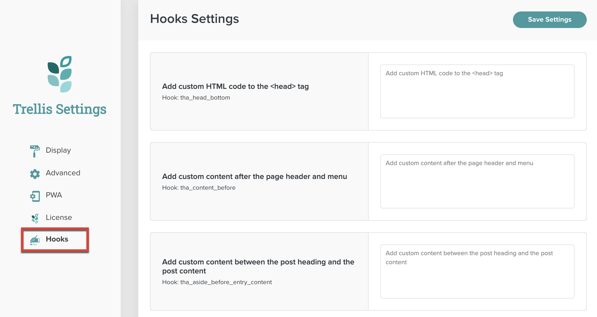

In addition to custom Mediavine hooks, Trellis uses the [Theme Hook Alliance (THA)](https://github.com/zamoose/themehookalliance) standards, offering a consistent set of entry points for easy customization and altering of functionality. Where applicable, this documentation references which THA hooks are called as part of a Mediavine hook.

{}
If you add custom templates to your child theme, it’s expected that you’ll include the appropriate hooks in your template files. This ensures compatibility with future versions of Trellis that rely on these hooks.
{}

## Usage

Publishers can add content to a subset of these hooks by going to the **Mediavine Trellis Dashboard > Hooks** section.

As a child theme developer, you can add content by calling the hook in your child theme’s functions.php file. 

## Sections

- [Aside Hooks](#aside-hooks)
- [Body Hooks](#body-hooks)
- [Content Hooks](#content-hooks)
- [Comment Hooks](#comment-hooks)
- [Critical CSS Hooks](#critical-css-hooks)
- [Entry Hooks](#entry-hooks)
- [Footer Hooks](#footer-hooks)
- [Head Hooks](#head-hooks)
- [Header Hooks](#header-hooks)
- [HTML Hooks](#html-hooks)
- [Image Processing Hooks](#image-processing-hooks)
- [Navigation Hooks](#navigation-hooks)
- [Search Hooks](#search-hooks)
- [Sidebar Hooks](#sidebar-hooks)
- [Theme Hooks](#theme-hooks)
- [Title Hooks](#title-hooks)

## Aside Hooks

#### mvt_aside_before_entry_content

Runs hooks inside the standard loop, before the `entry-content` container. This wraps any hooked content in an `aside` tag. Fires the `tha_aside_before_entry_content` hook.

#### mvt_aside_after_entry_content

Runs hooks inside the standard loop, after the `entry-content` container. This wraps any hooked content in an `aside` tag. Fires the `tha_aside_after_entry_content` hook.

## Body Hooks

#### mvt_body_top

Runs hooks immediately after `wp_body_open()`. Fires the `tha_body_top` hook.

#### mvt_body_bottom

Runs hooks immediately before `wp_footer()`. Fires the `tha_body_bottom` hook.

---

## Content Hooks

#### mvt_content_before

Runs hooks immediately before the opening `<main>` content tag. Fires the `tha_content_before` hook.

#### mvt_content_after

Runs hooks immediately after the closing `</main>` content tag. Fires the `tha_content_after` hook.

#### mvt_content_top

Runs hooks immediately after the opening `<main>` content tag. Fires the `tha_content_top` hook.

#### mvt_content_bottom

Runs hooks immediately before the closing `</main>` content tag. Fires the `tha_content_bottom` hook.

#### mvt_content_while_before

Runs hooks inside the standard loop, before the `while()` block. Fires the `tha_content_while_before` hook.

#### mvt_content_while_after

Runs hooks inside the standard loop, after the `while()` block. Fires the `tha_content_while_after` hook.

#### mvt_no_content_top

Runs hooks inside the standard loop when there are no posts to show, before the Trellis “No content found” notice. Fires the `tha_no_content_top` hook.

#### mvt_no_content_bottom

Runs hooks inside the standard loop when there are no posts to show, after the Trellis “No content found” notice. Fires the `tha_no_content_bottom` hook.

#### mvt_content_header_after

Runs hooks immediately after the closing `</header>` content tag. Fires the `tha_content_header_after` hook.

---

## Comment Hooks

#### mvt_comments_before

Runs hooks inside the standard loop, before the `comments_template()` wrapper. Fires the `tha_comments_before` hook.

#### mvt_comments_after

Runs hooks inside the standard loop, after the `comments_template()` wrapper. Fires two hooks: `comment_form_after` and `tha_comments_after`.

#### mv_trellis_comments_output

Fires where the comments template is output.

---

## Critical CSS Hooks

#### mv_trellis_crit_css_disable_flag

Fires when the disable_critical_css URL flag exists.

#### mv_trellis_crit_css_error

Fires when Critical CSS has an error while generating files. Accepts arguments.

**Arguments**

- $params `array` The API request parameters.

#### mv_trellis_crit_css_incoming

Fires when Critical CSS has a returned callback. Accepts arguments.

**Arguments**

- $params `array` The API request parameters.

#### mv_trellis_crit_css_success

Fires when Critical CSS is successfully generated and posted back. Accepts arguments.

**Arguments**

- $params `array` The API request parameters.

#### mv_trellis_pre_crit_css_req

Fires when Critical CSS is requested to be generated. Accepts arguments.

**Arguments**

- $params `array` The API request parameters.

#### mv_trellis_purge_critical_css

Fires after Critical CSS has been purged.

---

## Entry Hooks

#### mvt_entry_top

Runs hooks immediately after the opening `<article>` content tag. Fires the `tha_entry_top` hook.

#### mvt_entry_bottom

Runs hooks immediately before the closing `</article>` content tag. Fires the `tha_entry_bottom` hook.

#### mvt_entry_excerpt_before

Runs hooks inside the standard loop, before `the_excerpt()`. Fires the `tha_entry_excerpt_before` hook.

#### mvt_entry_excerpt_after

Runs hooks inside the standard loop, after `the_excerpt()`. Fires the `tha_entry_excerpt_after` hook.

#### mvt_entry_before

Runs hooks inside the standard loop, before the entry opening markup. Fires the `tha_entry_before` hook.

#### mvt_entry_after

Runs hooks inside the standard loop, after the entry closing markup. Fires the `tha_entry_after` hook. Accepts arguments.

**Default**

- Empty array

**Arguments**

$args `array` Contains arguments from the content passed to the hook. In the Trellis Core templates, content-article.php and content.php contain an item count for potential Mediavine ad placement.

#### mvt_entry_content_before

Runs hooks inside the standard loop, before `the_content()`. Fires the `tha_entry_content_before` hook.

#### mvt_entry_content_after

Runs hooks inside the standard loop, after `the_content()`. Fires the `tha_entry_content_after` hook.

#### mvt_trellis_entry_footer_top

Runs hooks immediately after the opening `<footer class="entry-footer">` tag. Fires the `tha_entry_footer_top` hook.

#### mvt_trellis_entry_footer_bottom

Runs hooks immediately before the closing entry-footer `</footer>` tag. Fires the `tha_entry_footer_bottom` hook.

---

## Footer Hooks

#### mvt_footer_before

Runs hooks immediately before the opening `<footer>` tag. Fires the `tha_footer_before` hook.

#### mvt_footer_after

Runs hooks immediately after the closing `</footer>` tag. Fires the `tha_footer_after` hook.

#### mvt_footer_top

Runs hooks immediately after the opening footer wrapper tag. Fires two hooks: `tha_footer_top` and `mv_trellis_footer` (which contains the main content of the footer).

#### mvt_footer_bottom

Runs hooks immediately before the closing footer wrapper tag. Fires the `tha_footer_bottom` hook.

---

## Head Hooks

#### mvt_head_top

Runs hooks immediately after the opening `<head>` tag. Fires the `tha_head_top` hook.

#### mvt_head_bottom

Runs hooks immediately before `wp_head()`. Fires the `tha_head_bottom` hook.

---

## Header Hooks

#### mv_trellis_before_header_content

Fires after the header menu and before any other header content.

#### mvt_header_before

Runs hooks immediately before the opening `<header>` tag. Fires the `tha_header_before` hook.

#### mvt_header_after

Runs hooks immediately after the closing `</header>` tag. Fires the `tha_header_after` hook.

#### mvt_header_top

Runs hooks immediately before the header container. Fires the `tha_header_top` hook.

#### mvt_header_bottom

Runs hooks immediately after the header container. Fires the `tha_header_bottom` hook.

---

## HTML Hooks

#### mvt_html_before

Runs hooks immediately before the opening `<html>` tag. Fires the `tha_html_before` hook.

---

## Image Processing Hooks

#### mv_trellis_before_image_process_loop

Fires before the foreach loop of the `process_images()` function.

#### mv_trellis_after_image_process_loop

Fires after the foreach loop of the `process_images()` function.

---

## Navigation Hooks

#### mvt_entry_navigation_before

Runs hooks inside the standard loop, before the article navigation markup. Fires the `tha_entry_navigation_before` hook.

#### mvt_entry_navigation_after

Runs hooks inside the standard loop, after the article navigation markup. Fires the `tha_entry_navigation_after` hook.

---

## Search Hooks

#### mv_trellis_search_form

Outputs the search form in the header.

---

## Sidebar Hooks

#### mvt_sidebars_before

Runs hooks immediately before `get_sidebar()`. Fires the `tha_sidebars_before` hook.

#### mvt_sidebars_after

Runs hooks immediately after `get_sidebar()`. Fires the `tha_sidebars_after` hook.

#### mvt_sidebar_top

Runs hooks immediately after the opening `<aside>` sidebar tag. Fires the `tha_sidebar_top` hook.

#### mvt_sidebar_bottom

Runs hooks immediately before the closing `</aside>` sidebar tag. Fires the `tha_sidebar_bottom` hook.

---

## Theme Hooks

#### mv_trellis_parent_loaded

Fires after the parent theme is loaded so that the child theme has access to options.

#### trellis_theme_activated

Fires when Trellis is activated for the first time, updated, or triggered by the REST endpoint.

#### trellis_theme_deactivated

Fires when Trellis is deactivated.

---

## Title Hooks

#### mvt_title_before

Runs hooks immediately before the content title, before the opening `<h1>` tag. Fires the `tha_title_before` hook.

#### mvt_title_after

Runs hooks immediately after the content title, after the closing `</h1>` tag. Fires the `tha_title_after` hook.